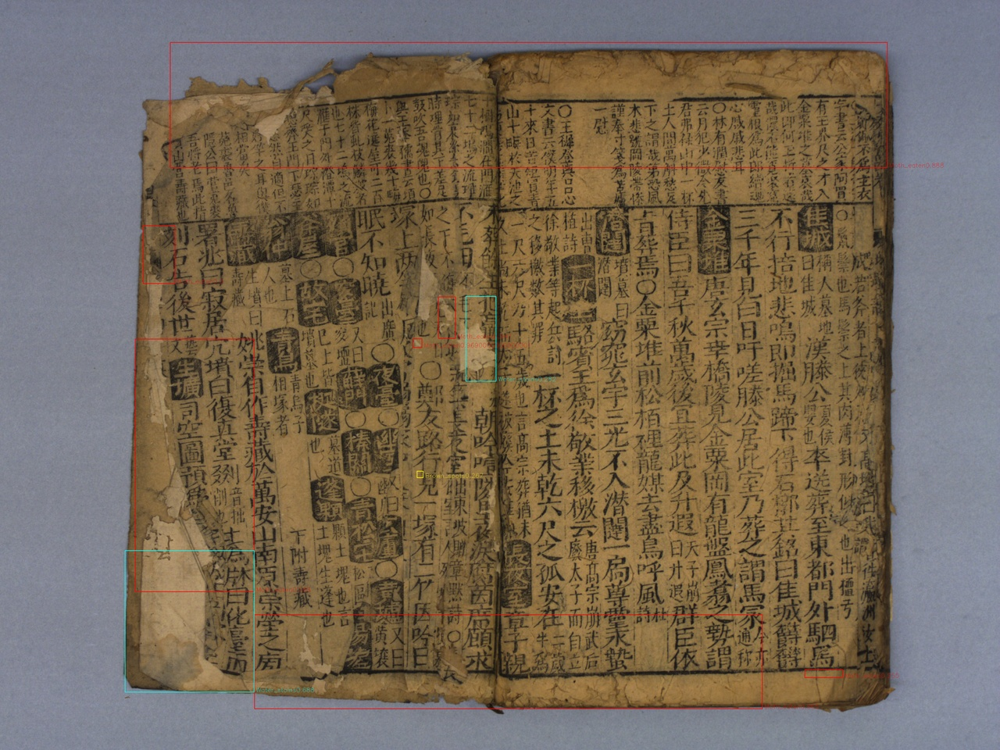
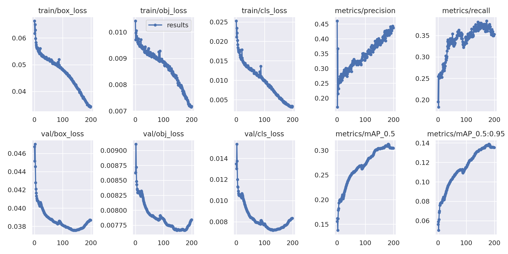

# 國立臺灣文學館典藏文物劣化辨識
## national museum of Taiwan literature

## purpose

detect **Deterioration** in any given images

## demo

## method
Object Detection Using **yolov5-large** 
https://github.com/ultralytics/yolov5

## training results

